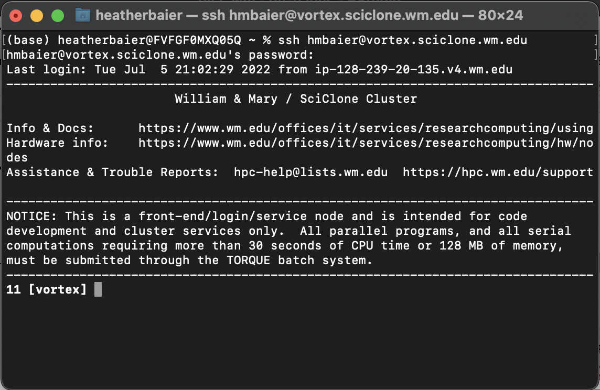

# 👋 Login & Basic Setup

### Logging In

Open a terminal on your computer and type:&#x20;

```
ssh [wm_username]@[subcluster_name].sciclone.wm.edu
```

For this example, we'll be logging into the Vortex sub-cluster, so type 'vortex' in place of \[subcluster\_name]. When prompted for a password, enter your W\&M password.

Your terminal should now look similar to this:



### Home Directory

Type `pwd` (print working directory) into your terminal. It should print out: `/sciclone/home20/<wm_username>`.

This is your landing directory - you'll open to this every time you login.

Now type `ls` into your terminal. If this is the first time you are logging in, you should see 4 folders print out. You can find read more about the purpose of each of these folders here: [https://www.wm.edu/offices/it/services/researchcomputing/using/files/index.php](https://www.wm.edu/offices/it/services/researchcomputing/using/files/index.php)

### Working Directories

You are free to make as many folders here (in home20) as you like, as long as you _do not_ store large amounts of data in them.

Best practice is to store code files within your home20 directory and data within a folder provided to you by Dan (or another professor) in either `/sciclone/geograd/` or `/sciclone/geounder/`

You can make a new folder using the `mkdir <folder_name>` command
