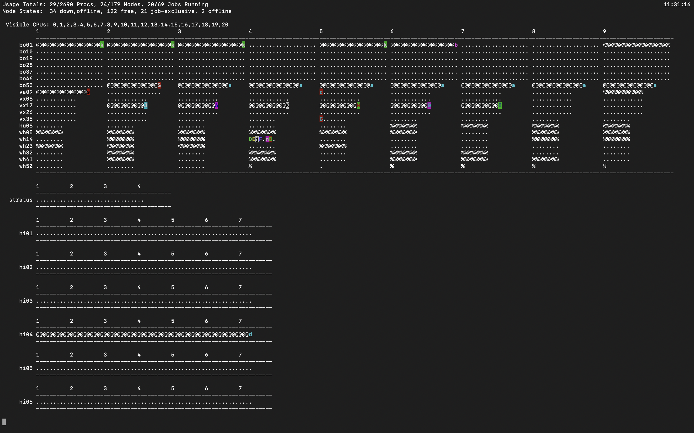

# 🗺 PBSTOP - Your Cluster Roadmap

Type `pbstop` into your terminal. You should see a screen that looks like this:

This is your 'birdseye view' of the cluster.

Some helpful terminology:

> **Cluster:** The cluster is the set of all sub-clusters within the W\&M HPC system.

> **Subcluster:** a set of computers with similar computing characteristics.

W\&M's HPC has multiple sub-clusters including Vortex, Bora, Hima, Meltemi, etc... You can read about each of them here: [https://www.wm.edu/offices/it/services/researchcomputing/hw/nodes/index.php](https://www.wm.edu/offices/it/services/researchcomputing/hw/nodes/index.php)

> **Node:** A node is an individual computer within a sub-cluster.

> **Core (aka Processor):** An individual processor on a node.

Each node on Vortex has 12 processors. This basically means you can run 12 individual python processes on a Vortex node, or 1 process on each processor. You could also run one process across multiple processors (or the whole node) if you need all of the memory available.
