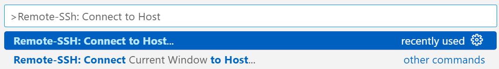

# 🚀 Integrating VS Code with HPC

### Installing VS Code and Remote Development Extension
The first step is to install [vscode](https://code.visualstudio.com/). Afterward, download the Remote Development extension from the Extensions tab in VS Code.


### Connecting to a Host with SSH in VS Code
Use the hotkey `Ctrl + Shift + P` to open the Command Palette and select "Remote-SSH: Connect to Host..."



Selecting it will bring up a prompt similar to the one seen in [Login & Basic Setup](login-and-basic-setup.md). Type in

```
ssh [wm_username]@[subcluster_name].sciclone.wm.edu
```
to connect you to the W&M HPC. When connecting to new SSH hosts, VS Code will ask to specify the platform of the remote host. As the W&M HPC runs Linux, you should answer Linux, regardless of your own computer's specifications. After connecting to the HPC, open the Explorer tab and click "Open Folder". Once that is set up, you can access files through the Explorer tab, edit them with VS Code, and use the VS Code terminal (Shortcut: ``Ctrl + ` ``).

### Adding Hosts to Saved List
If you frequently connect to specific servers, it is possible to save them as hosts. Select "Remote-SSH: Connect to Host..." through the Command Palette and then choose "Add New SSH Host". Doing so will prompt you to type in the same ssh command as above. However, this time it will not connect you to the host. Instead, it will save the host information, so you can easily select it through the Command Palette later. 

### Proxy Jumping when Remote
It is possible to directly connect to the W&M sciclone subclusters when connected to the William & Mary internet. However, if you are doing work remotely, you will need to ssh into stats.wm.edu and then the desired subcluster. To do so seamlessly,
open the Command Palette and select "Remote-SSH: Connect to Host..." again. This time, select "Configure SSH Hosts", which will open up the config file. Type
```
Host [sub_cluster]Remote
  HostName [subcluster].sciclone.wm.edu
  User [wm_username]
  ProxyJump stat.wm.edu
```
"\[sub_cluster]Remote" can be any name as it only is used to list the option in the Command Palette.