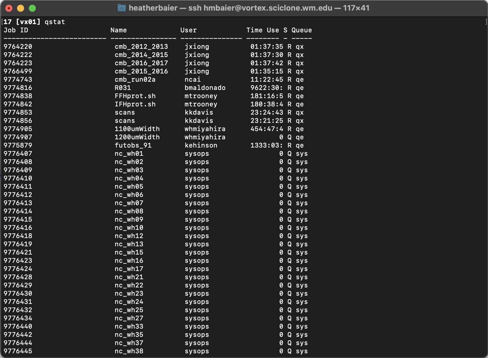
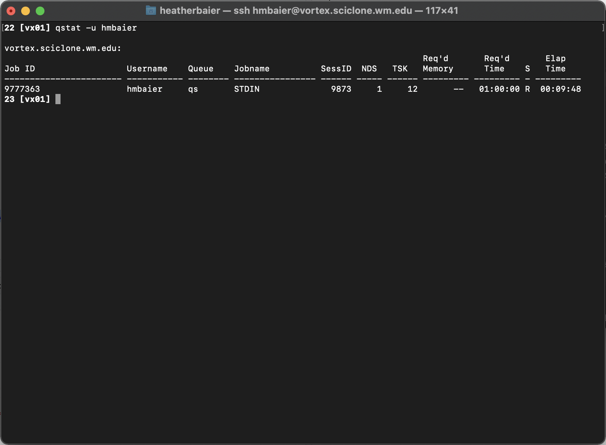
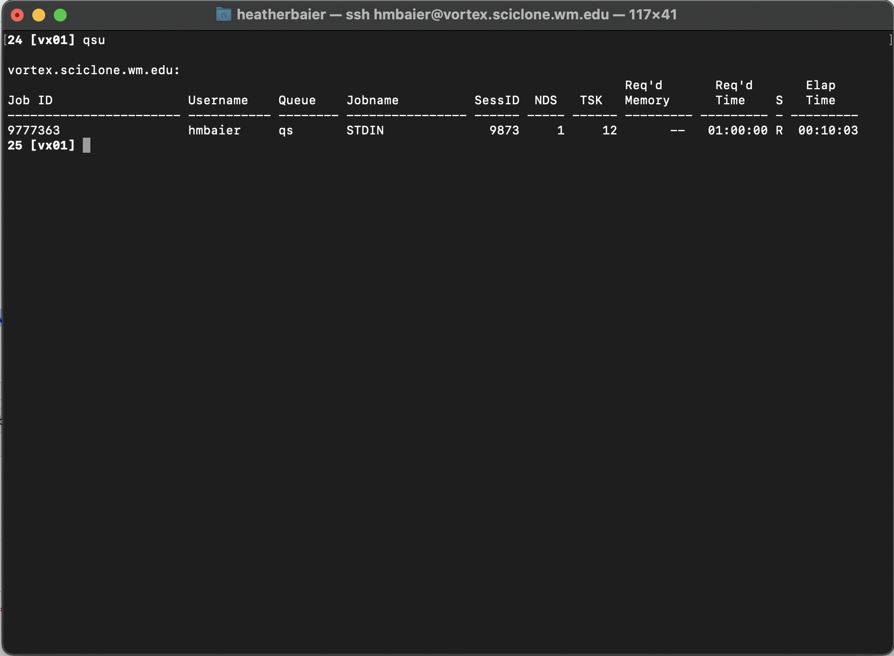

# Checking the status of your jobs

So you've launched a job, yay! There are two main ways that you can now check on the status of your jobs.

### qstat

Running `qstat` from your terminal will give you a table with statistics about all of the jobs currently running on the sub-cluster you are logged into. The output of this command will look like:

A much more helpful command however is `qstat -u [USERNAME]`.&#x20;

What does this table tell us?

> **Job ID:** The unique ID given to our job
>
> **Username:** The user who launched the job
>
> **NDS:** Number of nodes reserved
>
> **TSK:** Number of total processors reserved
>
> **Req'd Time:** Amount of walltime requested
>
> **Elap Time:** How long the job has been running for. If the job is in the queue and waiting to be launched, this line will look like `-----------`&#x20;

### qsu

`qsu` is a shortcut for `qstat -u [USERNAME]`. Running it will give you the exact same printout.

