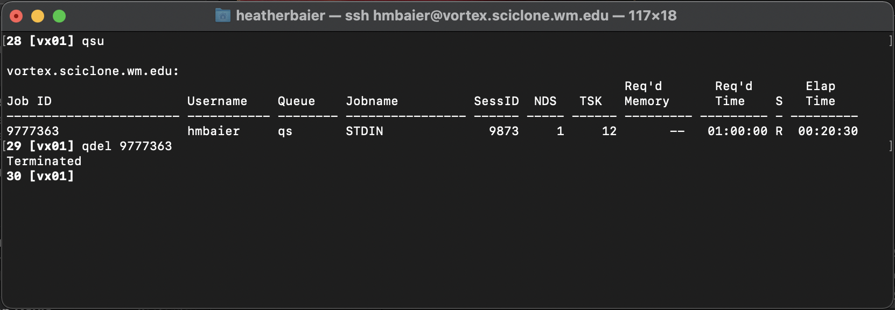

# Deleting Jobs

If for any reason you decide that you want to cancel a job before it has reach it's walltime limit, find the job ID (using either of the two methods in the previous page) and run `qdel [JOB ID]`

You should see `Terminated`, which indicates that the job has been successfully deleted.
