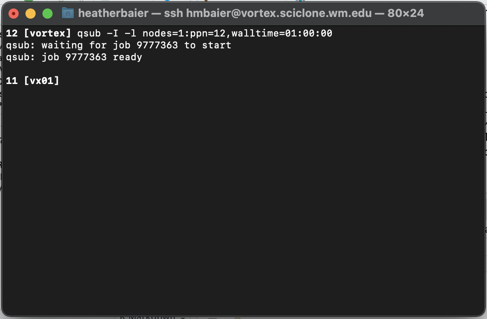

# Interactive Jobs

Interactive jobs function as if you were programming regularly from your terminal. I generally launch interactive jobs when I need to move large amounts of data or when I'm testing or debugging short bits of code. We can launch an interactive job using the following command:

```
qsub -I -l nodes=1:vortex:ppn=12,walltime=01:00:00
```

Let's break down this line:

> **qsub:** This is the command we use to submit a job to the queue. We will use this with non-interactive jobs as well.
>
> **-I:** This argument makes the job interactive (dash capitol I (as in interactive))
>
> **-l:** This argument specifies that we are next going to provide a list of arguments each separated by a comma (dash lowercase l (as in llama))
>
> **nodes=1:vortex:ppn=12:** The formatting of this line must remain the same, however you can modify the number of nodes, sub-cluster and number of processors that you want. The computer will checkout the specified number of nodes and processors for you on the sub-cluster you name.
>
> **walltime:** This is the amount of time you want to reserve the resources for. The maximum amount of time you can check-out on Vortex is 180 hours, however you should only checkout out nodes for as long as you think it will take your program to run. If your program exceeds the walltime limit, it will be terminated and all memory will be erased. The format is HH:MM:SS
>
>

If you run the above line from your home directory, you should see something similar to:



On line 11 in the screenshot above, you can see **\[vx01]** as opposed to the **\[vortex]** in line 12. This means that now that you have launched a job, you are no longer running on the main Vortex infrastructure. Instead, you have now checked out 12 processors on Vortex Node 1 and are running your code from there. If the line read instead **\[vx02]**, that would indicate you were on Vortex Node 2.&#x20;

It however doesn't matter which node you are actually on. Any Conda environments you've created and any files you have have will exist just the same on any node. To see this, type in `ls`. You'll see the same folders you saw when you ran `ls` from outside of the job. No matter what physical node you are running on on Vortex, you'll always see the same folders and files.

When you are done in an interactive job, you can exit by hitting `ctrl + d`

