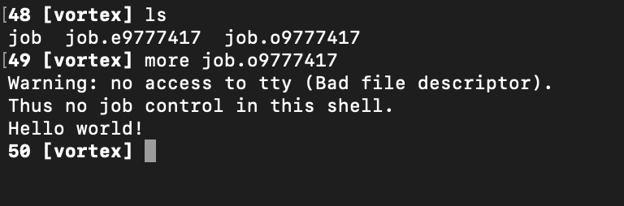

# Non-Interactive Jobs

Non-Interactive jobs are much more common, however they require what we call a job script. This is just a text file that might look like the following:

```
#!/bin/tcsh
#PBS -N demojob
#PBS -l nodes=1:vortex:ppn=12
#PBS -l walltime=00:30:00

echo "Hello world!"
```

We have the same list of arguments in this file that we had in our interactive job, except now we've given it a name using the -N argument.

### Example

First login in to Vortex and make sure you are in your home20 directory using the `pwd` command.

Next, make a folder called demo and navigate into it using the commands:

```
mkdir demo
cd demo
```

Once you're in your demo directory, make a new file called job.

```
touch job
```

Now, open your new job file in an editor in your terminal by running:

```
nano job
```

Within the nano editor, paste the code from above:

```
!/bin/tcsh
#PBS -N demojob
#PBS -l nodes=1:vortex:ppn=12
#PBS -l walltime=00:30:00

echo "Hello world!"
```

To exit the nano editor, use the following commands:

`ctrl + x`

`y`

`enter`

Now, type `qsub job` into your terminal. This will submit the job to the job queue. A string of digits (most likely starting with 9) will printout into your terminal. This is your job ID and means that the job has been successfully submitted!

After a couple seconds, type `ls` into your terminal. If you only see your job script, wait a few seconds longer and check again until you see two files that look similar to:


The two new files are your job output files. They will have the naming convention `[JOBFILENAME].e[JOBID]` and `[JOBFILENAME].o[JOBID]`. The file with a .e contains a printout of any errors that caused your job to fail. In this case, the file should be empty. Check that it is by running `more job.e9777417.`If nothing prints out, then your job ran successfully!

Next, check the job output file by running `more job.o9777417`



Ignore the Warning line and the line that starts with 'Thus'. The bottom line should say "Hello World!" thanks to our echo statement in the job script we submitted!
